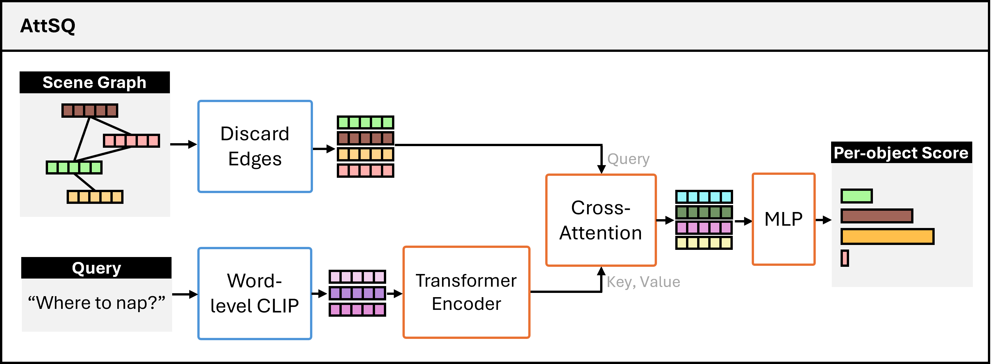

# Scene-Graph Attention for Visual Grounding in Indoor Environments

**Abstract**
We address the challenge of Visual Grounding (VG) in 3D indoor environments, which involves identifying objects in a scene corresponding to a natural language question. Existing solutions often struggle with complex reasoning tasks that require a deep understanding of both visual and textual information. Many current approaches rely on language priors, rather than an encoded understanding of the scene structure, and few have explored the potential of scene-graphs for this task. To tackle these challenges, we propose a novel approach for VG that leverages the strengths of Scene-Graphs, Graph Neural Networks (GNN), and Contrastive Language-Image Pre-trained Models (CLIP). Specifically, 1) we develop a Scene-Graph dataset for ScanNet using CLIP to embed images of objects into graph nodes, and a simple heuristics-based method to generate graph edges. Our dataset can be paired with Question-Answer datasets about ScanNet. 2) We propose an end-to end VG model, AttSQ+GNN, which integrates graph and text modalities using a Graph Neural Network to encode contextual scene information and a cross-attention mechanism to identify relevant objects within a scene based on a query. 3) We conduct a comprehensive evaluation of the model, its components, and the input data.

*Figure 1: AttSQ Architecture*

## Report
Implementation details and experimental results can be found in the report `report.pdf`.

## Setup
Clone repository and setup conda environment with `conda env create -f environment.yml` and `conda activate ms`.
To track data with Weights and Biases, setup using `wandb login`.

## Download Data
Download the [ScanNet](https://github.com/ScanNet/ScanNet) and [ScanQA](https://github.com/ATR-DBI/ScanQA) datasets.  If using ETH Euler, the ScanNet dataset is already downloaded at `/cluster/project/cvg/data/scannet`.

In this project, we use 2D segmentation, color images, poses and intrinsics. These are not part of the standard ScanNet dataset and need to be downloaded separately. More specifically:
- Unzip the ScanNet instance segmentation folder using `unzip_files.sh`. In the script, set the variables SCAN_DIR (path to ScanNet `scans` folder), OUT_DIR (path folders should be unzipped to) and SPLIT_FILE (list of scenes to unzip).
- Download the ScanNet sensor data by running `python reader.py --split_file /path/to/split/file/ --input_base_path /path/to/scannet/scans/ --output_base_path /path/to/output/ --export_color_images --export_poses --export_intrinsics`.
Note that if your storage is limited, this must be done in smaller batches on the scratch partition as to not exeed storage quota. The batch can be specified in the split file.

## Scene-Graph Dataset Generation
To generate scene-graph dataset, run `process_data.py`. Uncomment lines `606-609` to delete the downloaded files needed to generate the scene graph dataset.

## Train
To train the VG models, run `sbatch --mem-per-cpu=200G --time=24:00:00 --wrap="python main.py --train --config_path config.yaml"`.
Training settings can be changed in the `config.yaml` file. The `model.py` file contains the proposed models. The Baseline model is `Baseline`, the Baseline+GNN model is `CLIP_GNN`, the AttSQ model is `VQAModel_attn`. For the AttSQ+GNN model, uncomment line 225 and comment line 226.

## Evaluate
To test the VG models, run `sbatch --mem-per-cpu=200G --time=24:00:00 --wrap="python main.py --test --config_path config.yaml"`.